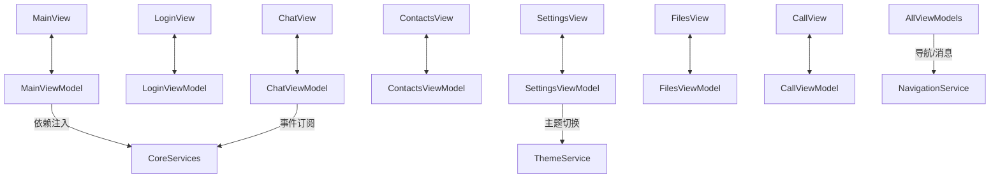

IMSystem.Client.Ui（基于 wpf-ui 4.0.2）UI 层结构化规划如下：

1. **推荐目录结构与命名规范**  
   - 根目录下分为 Views（主界面、登录、聊天、联系人、设置、文件、通话等）、ViewModels、Services、Themes、Assets、Controls、Converters、Behaviors、Extensions，命名采用 PascalCase，严格区分 MVVM 层次，符合 wpf-ui 约定。
2. **主要视图与 ViewModel 设计**  
   - MainView/MainViewModel：主框架与导航、全局消息、主题切换  
   - LoginView/LoginViewModel：登录注册、认证交互  
   - ChatView/ChatViewModel：单聊/群聊、消息、输入、文件、表情、已读等  
   - ContactsView/ContactsViewModel：联系人、分组、好友请求、群组管理  
   - SettingsView/SettingsViewModel：账号、隐私、主题、快捷键等设置  
   - FilesView/FilesViewModel：文件传输、历史、上传下载、预览  
   - CallView/CallViewModel：音视频通话、呼叫、接听、挂断、设备选择  
   - 各 ViewModel 负责状态管理、命令绑定、与 core 层服务交互，View 仅负责 UI 呈现与事件转发。
3. **与 core 层集成方式**  
   - 依赖注入：通过 DI 容器注册 core 层服务，ViewModel 构造注入  
   - 服务调用：ViewModel 通过接口调用 core 层业务服务  
   - DTO 映射：AutoMapper 或手动映射 core DTO 与 UI 层模型  
   - 事件/命令绑定：UI 事件通过 ICommand 绑定，ViewModel 订阅 core 层事件  
   - 消息/导航服务：统一消息通知与页面导航，解耦 UI 与业务逻辑
4. **主题与样式建议**  
   - 基于 wpf-ui 主题机制，集中管理 ResourceDictionary（Themes/Light.xaml, Dark.xaml）  
   - 利用 ThemeService 支持亮暗主题切换，持久化用户偏好  
   - 控件样式集中于 Themes/Controls.xaml，品牌色/字体在 App.xaml 统一定义
5. **组件复用、扩展性与维护性建议**  
   - 常用 UI 片段封装为 UserControl，便于复用  
   - 严格 MVVM 解耦，便于测试与维护  
   - 各功能模块独立，支持后续扩展  
   - 采用事件聚合器模式降低耦合，样式/主题集中管理

结构关系示意（Mermaid）：

本规划覆盖结构、职责、集成、主题与复用建议，适配 wpf-ui 4.0.2 及 MVVM 规范，便于后续开发与维护。