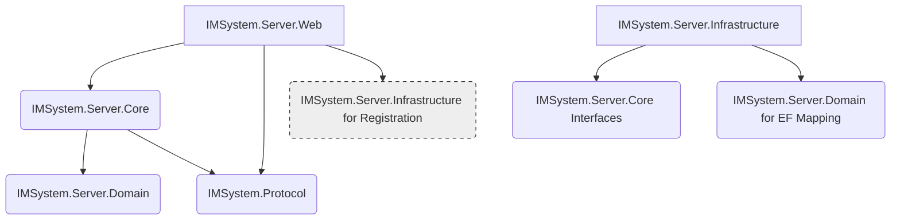
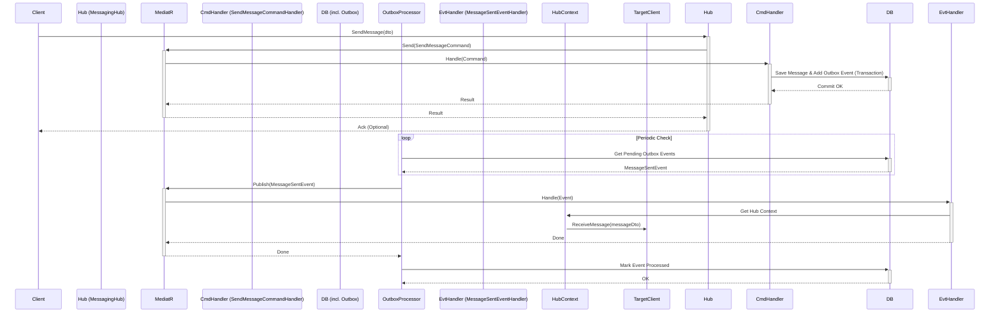

# IMSystem 服务端开发指南 (AI 优化版)

本文档旨在指导 AI 进行 IMSystem 服务端的开发，详细说明了架构、项目结构、技术选型、核心流程和开发规范。

## 1. 服务端概述

### 1.1 架构概览
- **Web框架**: ASP.NET Core WebApi (RESTful API)
- **实时通信**: SignalR (多个专用 Hub)
- **数据库**: SQL Server
- **缓存**: Redis
- **认证**: JWT Token
- **核心设计**: DDD & CQRS (使用 MediatR)

### 1.2 分层架构
- **表示层/API层 (`Web`)**: 处理 HTTP/SignalR 请求，DTO 转换 (AutoMapper)，请求分发 (MediatR)。
- **应用层/核心业务层 (`Core`)**: 编排业务流程，处理命令/查询 (MediatR Handlers)，领域事件处理，验证 (FluentValidation)。
- **领域层 (`Domain`)**: 核心领域模型 (实体, 值对象, 领域事件)，**无外部依赖**。
- **基础设施层 (`Infrastructure`)**: 实现接口 (数据持久化 EF Core, 缓存 Redis, 外部服务)。
- **共享协议层 (`Protocol`)**: 定义 DTOs，客户端/服务端共享。

## 2. 服务端项目结构与依赖

### 2.1 项目结构 (推荐)
```
Server/
│   ├── IMSystem.Server.Web/          # API & SignalR Hubs
│   │   ├── Controllers/            # 轻量级 API 控制器 (调用 MediatR)
│   │   ├── Hubs/                   # SignalR Hubs (按职责拆分: Messaging, Presence, Notification, Signaling)
│   │   ├── Profiles/               # AutoMapper 配置
│   │   ├── Extensions/             # Web 层服务注册
│   │   └── Program.cs              # 应用启动与配置
│   ├── IMSystem.Server.Core/         # 核心业务逻辑 (CQRS + MediatR)
│   │   ├── Features/               # 按特性组织 (Commands, Queries, Handlers, Validators)
│   │   │   ├── Authentication/
│   │   │   ├── Friends/
│   │   │   └── ...
│   │   ├── Interfaces/             # 仓储、服务接口定义 (供 Infrastructure 实现)
│   │   │   ├── Persistence/        # (IUserRepository, IMessageRepository, IUnitOfWork)
│   │   │   └── Services/           # (ICachingService, IFileStorageService)
│   │   ├── DomainEvents/           # 领域事件处理器 (INotificationHandler)
│   │   ├── Behaviors/              # MediatR Pipeline Behaviors (Validation, Logging, Transaction)
│   │   └── Extensions/             # Core 层服务注册
│   ├── IMSystem.Server.Infrastructure/ # 基础设施实现
│   │   ├── Persistence/            # EF Core (DbContext, Repositories 实现, Configurations, Migrations)
│   │   ├── Caching/                # Redis 实现
│   │   ├── Identity/               # JWT 服务实现
│   │   ├── ExternalServices/       # 文件存储等实现
│   │   └── Extensions/             # Infrastructure 层服务注册
│   ├── IMSystem.Server.Domain/              # 领域模型 (纯粹, 无依赖)
│   │   ├── Entities/             # (User, Message, FriendGroup, AggregateRoot)
│   │   ├── Enums/
│   │   ├── ValueObjects/         # (Email, Address)
│   │   ├── Exceptions/           # 领域特定异常
│   │   └── Events/               # 领域事件定义 (INotification)
Shared/
│   └── IMSystem.Protocol/            # 共享 DTOs
│       ├── DTOs/                   # (Requests, Responses, Common)
│       ├── Enums/
│       └── CommandsEvents/       # (可选) SignalR 强类型事件契约
```

### 2.2 项目依赖关系
- **`Web`** -> `Core`, `Protocol`, `Infrastructure` (仅用于服务注册)
- **`Core`** -> `Domain`, `Protocol` (查询可返回 DTO)
- **`Infrastructure`** -> `Core` (实现接口), `Domain` (EF 映射)
- **`Domain`** -> **无依赖**
- **`Protocol`** -> **无依赖**

**服务端项目依赖图 (Mermaid):**


### 2.3 DDD 模式在本项目的应用 (精简)

我们应用 DDD 模式管理业务复杂性：

1.  **聚合 (Aggregates) 与聚合根 (Aggregate Roots):**
    *   **概念:** 将强关联的对象组合成一个单元进行数据修改，通过聚合根访问。
    *   **应用:**
        *   `User` 聚合 (根: `User`): 管理用户信息、设置、`FriendGroup` 生命周期。**不直接管理分组下的好友列表**。
        *   `Group` 聚合 (根: `Group`): 管理群信息、成员列表 (`GroupMember`)。
        *   `Message` 聚合 (根: `Message`): 单个消息。
    *   **跨聚合关联 (如好友分配到分组):** 通过 **应用层服务 (MediatR Handler)** 协调，加载相关实体/聚合根，验证规则，直接操作关联数据 (如 `UserFriendGroups` 关联表)。

2.  **实体 (Entities) 与 值对象 (Value Objects):**
    *   **实体:** 有 ID，生命周期重要 (e.g., `User`, `Group`, `Message`, `FriendGroup`)。
    *   **值对象:** 无 ID，由属性定义，通常不可变 (e.g., `Email`, `Address`, `FileName`)。

3.  **领域事件 (Domain Events):**
    *   **概念:** 表示领域中发生的重要事情，用于解耦。
    *   **应用 (Outbox Pattern):**
        1.  **事务内**: 核心业务操作 + 将事件信息写入 `OutboxMessages` 表。
        2.  **事务提交**。
        3.  **后台服务 (`OutboxProcessorService`)**: 轮询 Outbox 表，读取事件。
        4.  **发布**: 通过 `IMediator.Publish()` 分发给 `Core` 层的事件处理器 (`INotificationHandler`)。
        5.  **处理**: 事件处理器执行副作用 (发通知、更新缓存、调用 `IHubContext` 推送等)。
        6.  **标记完成**: 更新 Outbox 记录状态。

4.  **仓储 (Repositories):**
    *   **概念:** 模拟集合访问聚合根，封装持久化。
    *   **应用:**
        *   **接口**: 定义在 `Core/Interfaces/Persistence` (e.g., `IUserRepository`)。
        *   **实现**: 在 `Infrastructure/Persistence/Repositories` (使用 EF Core)。
        *   **使用**: 在 `Core` 层的 MediatR Handlers 中注入接口。

5.  **领域服务 (Domain Services):**
    *   **概念:** 处理不适合放在实体/值对象中的、跨多个对象的领域逻辑。
    *   **应用:** 较少使用，复杂逻辑优先考虑在 MediatR Handler 中编排。若需要纯领域逻辑服务，放 `Domain`；若需依赖注入，放 `Core`。

## 3. 服务端核心功能与技术选型

### 3.1 核心功能 (服务端视角)
- 用户认证/授权 (JWT)
- 用户/好友/分组管理 API & 实时通知
- 消息存储/转发/离线处理 (SignalR)
- 群组管理 API & 群消息 (SignalR)
- 文件上传/存储/访问控制
- 音视频通话信令 (SignalR)

### 3.2 技术选型核心
- **框架**: ASP.NET Core 8+
- **实时通信**: SignalR
    - **原则**: 轻量级 Hub (委托 MediatR), 职责分离 (多 Hub), 服务端推送由事件处理器通过 `IHubContext` 发起。
- **API**: RESTful
- **ORM**: EF Core
- **数据库**: SQL Server
- **缓存**: Redis (StackExchange.Redis)
- **认证**: JWT
- **DI**: 内置
- **日志**: Serilog
- **验证**: FluentValidation
- **映射**: AutoMapper
- **CQRS**: MediatR

### 3.3 API 契约示例 (简化)

定义在 `IMSystem.Protocol/DTOs` 中，通过 `Web/Controllers` 暴露。

```
// 请求 DTO (Protocol/DTOs/Requests/Friends/AddFriendRequest.cs)
public class AddFriendRequest { public string FriendUsername { get; set; } }

// 响应 DTO (Protocol/DTOs/Responses/Friends/FriendDto.cs)
public class FriendDto { public string UserId { get; set; } public string Username { get; set; } /* ... */ }

// API 端点 (Web/Controllers/FriendsController.cs)
[HttpPost]
public async Task<IActionResult> AddFriend([FromBody] AddFriendRequest request)
{
    // 1. Map request DTO to MediatR Command
    var command = _mapper.Map<AddFriendCommand>(request);
    // 2. Send Command via MediatR
    var result = await _mediator.Send(command);
    // 3. Handle result and return response (e.g., Ok, BadRequest)
    return Ok();
}

[HttpGet]
public async Task<ActionResult<IEnumerable<FriendDto>>> GetFriends()
{
    // 1. Create MediatR Query
    var query = new GetFriendsQuery(); // Assuming query needs current user ID from context
    // 2. Send Query via MediatR (Handler returns FriendDto list directly)
    var friends = await _mediator.Send(query);
    // 3. Return response
    return Ok(friends);
}
```

### 3.4 SignalR Hub 契约示例 (`MessagingHub`)

Hub 方法接收客户端调用，并将处理委托给 MediatR。服务端推送由领域事件处理器发起。

```csharp
// Hub (Web/Hubs/MessagingHub.cs)
public class MessagingHub : Hub
{
    private readonly IMediator _mediator;

    public MessagingHub(IMediator mediator) { _mediator = mediator; }

    // 客户端调用此方法发送消息
    public async Task SendMessage(SendMessageDto messageDto)
    {
        // 1. Map DTO to MediatR Command
        var command = new SendMessageCommand { /* ... map properties ... */ };
        // 2. Send Command (Handler will save message & raise Domain Event)
        await _mediator.Send(command);
        // Hub 方法通常不直接推送，推送由事件处理器完成
    }

    // 服务端推送方法 (由事件处理器通过 IHubContext<MessagingHub> 调用)
    // public async Task ReceiveMessage(MessageDto message) { /* Client implements this */ }
}

// 客户端接口 (可选，用于强类型客户端)
public interface IMessagingClient
{
    Task ReceiveMessage(MessageDto message);
    Task ReceiveMessageReadReceipt(Guid messageId, string readerUserId);
}

// 服务端推送示例 (在 MessageSentEventHandler 中)
// await _hubContext.Clients.User(recipientUserId).ReceiveMessage(messageDto);
// await _hubContext.Clients.Group(groupId).ReceiveMessage(messageDto);
```

### 3.5 缓存策略 (Redis)
- **模式**: Cache-Aside (读：查缓存 -> 查 DB -> 写缓存；写：更新 DB -> **删缓存 (通过领域事件)**)。
- **数据**: 用户信息, 在线状态, 好友列表, 群成员列表等热点数据。
- **失效**: TTL (兜底) + **主动失效** (领域事件处理器删除相关 Key)。
- **实现**: `ICachingService` 接口 (Core) -> Redis 实现 (Infrastructure)。

### 3.6 文件存储方案
- **方式**: 云对象存储 (Azure Blob, S3) + 预签名 URL。
- **元数据**: 存 SQL Server (`Files` 表)。
- **上传**: Client -> API (获取预签名上传 URL) -> Client 直接 PUT 到云存储 -> Client (可选) -> API (确认上传)。
- **下载**: Client -> API (获取预签名下载 URL, **含授权检查**) -> Client 直接 GET 从云存储。
- **实现**: `IFileStorageService` 接口 (Core) -> 云存储 SDK 实现 (Infrastructure)。

## 4. 数据库设计与部署

### 4.1 数据库核心表
- Users, Friends, FriendGroups, UserFriendGroups, Groups, GroupMembers, Messages, Files, OutboxMessages

### 4.2 部署架构 (计划)
- **托管**: 云服务 (App Service, Beanstalk), K8s, IIS
- **数据库**: 云数据库 (Azure SQL, RDS), 本地 SQL Server
- **缓存**: 云缓存 (Azure Redis, ElastiCache), 本地 Redis
- **扩展**: 负载均衡, SignalR Redis Backplane / Azure SignalR Service

## 5. 服务端开发流程建议 (AI 重点)

**核心流程图 (消息发送与推送 - 简化):**


**开发步骤 (基于特性切片):**

1.  **领域 (`Domain`)**: 设计/修改实体、值对象、领域事件。
2.  **协议 (`Protocol`)**: 设计/修改 DTOs。
3.  **接口 (`Core.Interfaces`)**: 定义新仓储/服务接口。
4.  **基础设施 (`Infrastructure`)**: 实现接口，更新 DbContext。
5.  **特性 (`Core.Features`)**:
    *   创建 Command/Query。
    *   (推荐) 创建 Validator (FluentValidation)。
    *   **实现 Handler (`IRequestHandler<...>`):**
        *   **Command Handler**: 处理业务逻辑，与领域实体交互，调用仓储保存，**将领域事件写入 Outbox**。**不返回 Response DTO**。
        *   **Query Handler**: 查询数据，**使用投影直接映射到 Response DTO** 并返回。
    *   **(事件)** 创建领域事件处理器 (`INotificationHandler<...>`) 处理副作用 (通过 Outbox 触发)。

    ```csharp
    // 简化 Command Handler 示例 (Core/Features/Messages/Commands/SendMessageCommandHandler.cs)
    public class SendMessageCommandHandler : IRequestHandler<SendMessageCommand, Result>
    {
        private readonly IMessageRepository _messageRepo;
        private readonly IUserRepository _userRepo;
        private readonly IOutboxRepository _outboxRepo; // 用于写入 Outbox
    
        public SendMessageCommandHandler(...) { /* Inject dependencies */ }
    
        public async Task<Result> Handle(SendMessageCommand request, CancellationToken cancellationToken)
        {
            // 1. Validation (can be done via MediatR behavior)
            // 2. Load aggregates/entities (e.g., sender, recipient/group)
            var sender = await _userRepo.GetByIdAsync(request.SenderId);
            // ... load recipient or group ...
    
            // 3. Create domain entity
            var message = Message.Create(sender.Id, request.RecipientId, request.Content /* ... */);
    
            // 4. Create domain event
            var domainEvent = new MessageSentEvent(message.Id, sender.Id, request.RecipientId /* ... */);
    
            // 5. Save aggregate & Add event to Outbox (within the same transaction)
            await _messageRepo.AddAsync(message);
            await _outboxRepo.AddAsync(domainEvent); // Add event to Outbox table
    
            // 6. Unit of Work SaveChangesAsync() or let Transaction Behavior handle commit
            // await _unitOfWork.SaveChangesAsync(cancellationToken);
    
            return Result.Success(); // Or specific result
        }
    }
    ```

6.  **映射 (`Web.Profiles`)**: 配置 AutoMapper。
7.  **端点 (`Web.Controllers` / `Web.Hubs`)**:
    *   注入 `IMediator`, `IMapper`。
    *   接收请求 DTO / Hub 参数。
    *   映射到 Command/Query。
    *   `await _mediator.Send(...)`。
    *   处理结果/返回响应。**Hub 方法不直接推送**。

    ```csharp
    // 简化 Controller Action 示例 (Web/Controllers/MessagesController.cs)
    [HttpPost]
    public async Task<IActionResult> SendMessage([FromBody] SendMessageRequest request)
    {
        var command = _mapper.Map<SendMessageCommand>(request);
        // Add user ID from HttpContext if needed
        // command.SenderId = User.FindFirstValue(ClaimTypes.NameIdentifier);
        var result = await _mediator.Send(command);
        return result.IsSuccess ? Ok() : BadRequest(result.Error);
    }
    
    // 简化 Hub 方法示例 (Web/Hubs/MessagingHub.cs)
    public async Task SendMessage(SendMessageDto messageDto) // DTO from Protocol
    {
        var command = new SendMessageCommand { /* Map from DTO */ };
        // Add user ID from Hub Context
        // command.SenderId = Context.UserIdentifier;
        await _mediator.Send(command); // Handler saves & raises event for Outbox
    }
    ```
8.  **DI (`Program.cs` / `Extensions`)**: 注册新服务。
9.  **测试 (`Tests`)**: 单元测试 (Handlers, Domain), 集成测试 (API -> DB)。

## 6. AI 开发核心规则

*   **遵循分层**: 严格遵守各层职责，禁止跨层调用（除明确允许的依赖）。
*   **业务逻辑在 Core**: 核心业务处理放在 `Core` 层的 MediatR Handlers 中。
*   **领域模型纯粹**: `Domain` 层只包含业务模型和规则，无基础设施依赖。
*   **轻量级 Web 层**: `Web` 层 (Controllers, Hubs) 保持轻量，仅做请求分发和 DTO 转换。
*   **CQRS**: 命令 (写操作) 不应返回数据，查询 (读操作) 不应修改状态。查询 Handler 推荐直接返回 `Protocol` DTO。
*   **异步优先**: 所有 I/O 操作 (数据库、网络) 使用 `async/await`。
*   **依赖注入**: 使用构造函数注入依赖项。
*   **Outbox 模式**: 领域事件通过 Outbox 模式处理，确保可靠性和事务性。Handler 中不直接 `Publish` 事件。
*   **协议驱动**: `Protocol` 项目是通信契约，优先定义和保持稳定。
*   **测试覆盖**: 为 Handler 和领域逻辑编写单元测试，为关键流程编写集成测试。

## 7. 服务端第三方库建议
- **核心**: ASP.NET Core, SignalR, EF Core, MediatR
- **数据**: SQL Server Provider, StackExchange.Redis
- **工具**: AutoMapper, FluentValidation, Serilog, Swashbuckle
- **认证**: System.IdentityModel.Tokens.Jwt
- **后台任务**: Hangfire / Quartz.NET (可选)

## 8. 测试策略 (概述)
- **单元测试 (xUnit/NUnit + Moq/NSubstitute)**:
    - `Domain`: 实体/值对象逻辑。
    - `Core`: **MediatR Handlers (重点)**, Validators (Mock 依赖)。
    - `Web`: 轻量级 Controller/Hub 逻辑 (Mock MediatR)。
- **集成测试 (`WebApplicationFactory`, EF Core InMemory/Testcontainers)**:
    - API 端点 -> 数据库/缓存/Outbox 完整流程。
- **特定场景**:
    - Mock `IHubContext` 测试事件处理器的推送逻辑。
    - 测试 Outbox Processor 处理流程。
